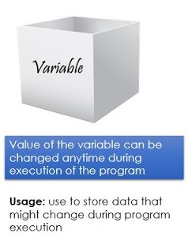

<h1><center>Python-Variables</center></h1>

<center>
<br>
<a href="https://www.youtube.com/channel/UCGHNehAJE0sq6ayR3x3gCiA">Youtube Channel</a>
</center>

<h3><b>What is a variable?</b></h3>

<ul>
    <li>A memory location.</li>
    <li>A name that is associated with that location.</li>
    <li>The memory location is used to hold data.</li>
</ul>

<b>Dynamic Typing</b> - We don't have to declare the type of variable while assigning a value to a variable in Python. Like in other languages like C, C++, Java, etc..,

<center></center>

<h3><b>How to declare?</b></h3>

<center><h3>variable-name = value</h3></center>


```python
value1 = 20
value1
```


    20


```python
value1 = 30
value1
```


    30


```python
value2 = 3.14
value2
```


    3.14


```python
value3 = "hello"
value3
```


    'hello'


